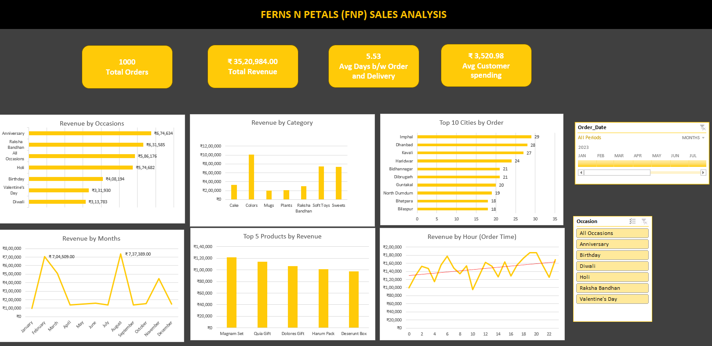

# Ferns-N-Petals-Sales-Analysis (Interactive Dashboard using MS Excel)

## Project Objective
Ferns N Petals (FNP) wants to analyze their sales performance across occasions, cities, categories, and time periods so that the business can identify peak seasons, top-performing products, and customer behavior to grow revenue in the coming year.

## Dataset Used
- [Dataset](Ferns_and_Petals_Data_Analysis.xlsx)

## Questions (KPIs)
- Which occasion generates the highest revenue?
- Which product category contributes most to sales?
- Which months show the highest and lowest revenue?
- What are the top 10 cities by number of orders?
- Which are the top 5 products by revenue?
- At what time of day do customers place the most orders?
- What is the average delivery time from order to delivery?
- What is the average spending per customer?

## Dashboard Interaction
- [View Dashboard](fnp_dashboard.png)

## Process
- Extracted raw data using Power Query Editor (PQE)
- Cleaned data by removing missing values, duplicates, and formatting inconsistencies
- Transformed data by standardizing date formats, city names, and category labels
- Built data model using Power Pivot and created pivot tables & measures for each KPI
- Designed an interactive dashboard with slicers for Occasion and Order Date filtering

## Dashboard

## Project Insights
- **Anniversary** is the highest revenue-generating occasion (₹6,74,634), followed by Raksha Bandhan (₹6,31,585) , together driving the majority of total revenue
- **Holi** (₹5,74,682) and **All Occasions** (₹5,86,176) also perform strongly, indicating consistent demand beyond festival-specific periods
- **Diwali** (₹3,13,783) and **Birthday** (₹4,08,194) are the lowest-performing occasions, representing a clear opportunity for targeted promotional campaigns
- **Valentine's Day** despite lower occasion revenue (₹3,31,930) drives a strong February (₹7,04,509), suggesting high order volume with lower average order value
- **Colors** is the top-selling category (breaching the ₹10 Lakh mark), followed closely by **Soft Toys** and **Sweets** confirming that vibrant, celebratory, and traditional gifting items dominate FNP sales
- **August** (₹7,37,389) and **February** (₹7,04,509) are peak revenue months driven by Raksha Bandhan and Valentine's Day seasons respectively
- **January, April and May** record the lowest revenue, ideal periods for discount campaigns and customer retention offers
- **Tier-2 cities** surprisingly lead in order count, Imphal (29), Dhanbad (28) and Kavali (27),indicating strong untapped demand outside metro cities
- **Magnam Set** is the best-selling product by revenue, followed by Quia Gift and Dolores Gift among the top 5
- Revenue shows a clear **peak during evening hours (18:00 - 20:00)** making this specific 2-hour window the absolute best time for push notifications and flash sales
- Average delivery time is **5.53 days**, reducing this can directly improve customer satisfaction and repeat purchases
- Average customer spending stands at **₹3,520.98** across **1,000 orders** generating total revenue of **₹35,20,984**

## Final Conclusion
FNP should prioritize marketing around **Anniversary and Raksha Bandhan** as they are the strongest revenue drivers. **Diwali and Birthday** occasions need stronger gift curation and promotional strategies to improve their performance. Introducing special offers in **January, April, and May** can balance seasonal revenue dips. Since **evening hours (6 PM - 8 PM)** see peak order activity, targeted push notifications and limited-time deals during this window can significantly boost conversions. Tier-2 cities like **Imphal, Dhanbad, and Kavali** represent a major untapped growth market and deserve focused delivery infrastructure and marketing investment. Reducing the average delivery time below **5 days** should be a key operational goal to improve customer retention.

## Tools Used
- Microsoft Excel — Power Query Editor (Data Extraction & Transformation)
- Power Pivot (Data Modelling)
- Pivot Tables & Measures (Data Analysis)
- Charts, Slicers & Dashboard Design (Data Visualization)
